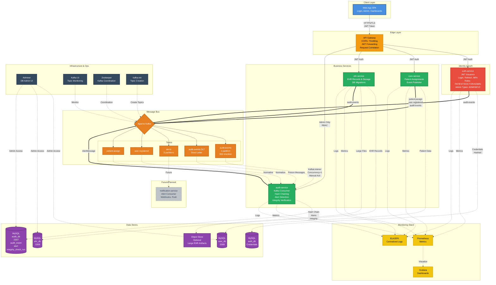

# Secure EHR Platform

This repository contains a comprehensive, secure Electronic Health Record (EHR) platform built on a microservices architecture. It demonstrates best practices for building robust, scalable, and secure healthcare applications, including role-based access control, end-to-end data encryption, and tamper-evident audit logging.

## Architecture

The platform is designed as a collection of decoupled microservices, each with a specific responsibility. This promotes scalability, fault tolerance, and independent development.

- **`api-gateway`**: The single entry point for all client requests. It handles routing, JWT validation, CORS, request aggregation, and other cross-cutting concerns.
- **`identity-service`**: Manages user authentication and authorization. It handles user registration, login, role management, and the issuance of JSON Web Tokens (JWTs).
- **`config-server`**: Provides centralized configuration management for all microservices using Spring Cloud Config.
- **`discovery-server`**: A Eureka server that allows services to register themselves and discover others.
- **`care-service`**: Manages the relationships and administrative aspects of patient care, such as doctor-patient assignments and access consents.
- **`ehr-service`**: The core service for managing patient health records. It handles creation, versioning, and secure storage of encrypted EHR data and lab files.
- **`audit-service`**: A critical security component that consumes events from a Kafka topic to create a tamper-evident, hash-chained log of all significant activities in the system. It also includes an alerting engine for suspicious behavior.
- **`frontend`**: A React-based single-page application that provides user interfaces for different roles, including doctors, receptionists, and administrators.
---

### Core Technologies

- **Backend**: Java 21, Spring Boot 3, Spring Cloud
- **Frontend**: React, Vite, Tailwind CSS
- **Data Persistence**: MySQL, Redis
- **Messaging**: Apache Kafka
- **Security**: Spring Security, JWT
- **Infrastructure**: Docker
## Key Features

### Security & Compliance

- **Role-Based Access Control (RBAC)**: Fine-grained access control based on user roles (e.g., `SUPER_ADMIN`, `SYSTEM_ADMIN`, `DOCTOR`, `PATIENT`). The `identity-service` embeds the user's role into the JWT, which is then used by downstream services to enforce permissions.
- **End-to-End Encryption**:
    - **EHR Data**: Patient records are encrypted at the application layer using AES/GCM before being stored in the database. The `ehr-service` manages an envelope encryption scheme with a master key.
    - **Lab Files**: Binary files (e.g., lab reports, X-rays) are encrypted using a unique data key for each file, which is then encrypted with the master key.
- **Tamper-Evident Auditing**: All critical actions (logins, data access, record updates) are published as events to a Kafka topic. The `audit-service` consumes these events and stores them in a database, creating a cryptographic hash chain. Each new log entry's hash is computed using the hash of the previous entry, making it computationally infeasible to tamper with logs without breaking the chain.
- **Security Alerting**: The `audit-service` continuously monitors the event stream for suspicious patterns, such as:
    - Multiple failed login attempts.
    - Bulk data access or export.
    - Unauthorized access attempts.
    - High-privilege administrative actions.
- **Secure Authentication**: Uses JWTs for stateless authentication. Includes refresh tokens and secure token storage. Also features session inactivity timeouts managed via Redis.

### Data Management

- **EHR Versioning**: Every modification to a patient's record creates a new, immutable version in the `ehr_record_version` table. This provides a complete, auditable history of changes.
- **Optimistic Locking**: The `ehr_record_current` table uses a `@Version` field to prevent race conditions and ensure data consistency during concurrent updates.
- **Secure File Storage**: Lab results and other sensitive files are stored encrypted on the file system, not directly in the database. The path and encryption key details are managed by the `ehr-service`.

## Getting Started

### Prerequisites

- Java 21
- Maven 3.8+
- Docker and Docker Compose
- Node.js 18+ and npm

### 1. Infrastructure Setup

The project uses Docker to manage its core infrastructure components.

**Start Databases and Caching:**
This command will start MySQL instances for each service, Redis for caching and session management, and Zipkin for distributed tracing.

```bash
cd docker
docker-compose up -d
```

**Start Kafka:**
The audit service relies on Apache Kafka. A separate Docker Compose file is provided to set it up.

```bash
cd backend/audit-service
docker-compose -f docker-compose.kafka.yml up -d
```
This will start Zookeeper, Kafka, and a Kafka-UI instance accessible at `http://localhost:8090`.

**Initialize Databases:**
SQL scripts for creating the necessary databases and tables are located in `infra/mysql-init/`. You can run these manually using a MySQL client connected to the respective ports (3307 for `identity-db`, 3308 for `care-db`, etc.).

### 2. Run Backend Services

Backend services must be started in a specific order due to dependencies on the Config Server and Discovery Server. For each service, navigate to its directory and run the Maven command.

1.  **Config Server**: `config-server`
2.  **Discovery Server**: `discovery-server`
3.  **Identity Service**: `identity-service`
4.  **Care Service**: `backend/care-service`
5.  **EHR Service**: `backend/ehr-service`
6.  **Audit Service**: `backend/audit-service`
7.  **API Gateway**: `backend/api-gateway`

**Example for starting the Config Server:**
```bash
cd config-server
mvn spring-boot:run
```
Repeat this process for all other services in the correct order.

### 3. Run Frontend Application

Navigate to the frontend directory, install dependencies, and start the development server.

```bash
cd frontend/web-app
npm install
npm run dev
```

The application will be available at `http://localhost:5173`.

### Default Credentials

The `identity-service` automatically creates a `SUPER_ADMIN` user on its first run. The credentials are an important part of the configuration:
- **Email**: `superadmin@genzipher.com`
- **Password**: `SuperAdmin@20260702`

These are defined in `identity-service/src/main/java/com/genzipher/identityservice/Bootstrap/SuperAdminInitializer.java` and can be overridden via `config-server`. It is highly recommended to change this password immediately after the first login. New users (System Admins, Doctors) are created with a secure, randomly generated temporary password that is displayed upon creation.
